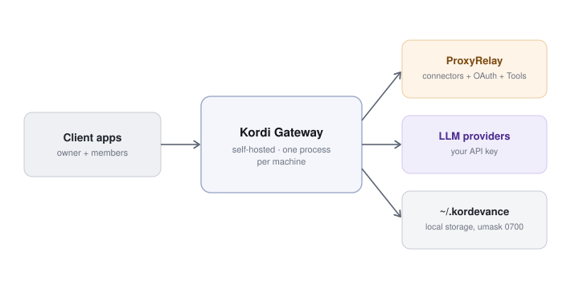

<p align="center">
  
</p>

# Kordevance Agent (Kordi Gateway)

**The local gateway that runs your AI goal planner.**

<p align="center">
  <a href="https://github.com/Kordevance/kordevance-agent/actions/workflows/ci.yml"></a>
  <a href="LICENSE"></a>
  
  
  <a href="https://github.com/astral-sh/ruff"></a>
  
</p>

Kordevance is a self-hosted planning agent built for open-ended goals, from launching a
project to preparing for exams or picking up a new language. Static to-do lists
usually stall on these bigger journeys because they require constant manual upkeep,
but Kordevance keeps your momentum going behind the scenes.

Running locally on your machine as the Kordi Gateway, it securely manages your goals
and API keys while periodically checking in to adapt your roadmap to whatever target
you set. Instead of trying to be a general-purpose assistant, it focuses on doing
one thing really well: keeping any long-term ambition on track using the models
you choose and control.

## How it works

<p align="center">
  
</p>

The Kordi Gateway runs as a single self-hosted process on your machine, handling all
local orchestration and state. It stores everything securely under ~/.kordevance
and speaks directly to your choice of LLM provider using your own API keys.

External integrations and OAuth handshakes are offloaded to ProxyRelay, a dedicated
service that manages connector credentials.

## Features

- **Goals that stay current on their own** — the gateway checks in on each goal on a
  schedule you set, without you having to remember to. Default is every 2 Hours.
- **Bring your own model, bring your own accounts** — pick from Anthropic, OpenAI,
  Gemini, Mistral, xAI, DeepSeek, OpenRouter, or any OpenAI-compatible endpoint.
- **Runs on your machine, not ours** — no cloud dependency for the gateway itself. Your
  goals, conversations, and API keys never leave local storage.

## Install

Signed (macOS only), native packages are published on
[GitHub Releases](https://github.com/Kordevance/kordevance-agent/releases) for macOS,
Linux, and Windows. Each installs the gateway as a background service, plus the `kordi`
CLI.

**Linux** (installs a systemd service):

```bash
curl -fsSL https://kordevance.com/install.sh | sh
```

**macOS** -- download the signed, notarized `.pkg` for your architecture (`arm64` /
`x86_64`) from the latest release and run it. It installs a `launchd` agent.

**Windows** -- download and run `Kordevance-Setup.exe` from the latest release. It
installs a Windows service.

Each platform also ships an uninstaller that removes the service without touching
`~/.kordevance`.

### From source

Requires Python 3.11–3.14 and [Poetry](https://python-poetry.org/).

```bash
poetry install
poetry run poe serve   # starts the API on 127.0.0.1:24680
```

## Getting started

[//]: # (1. Start the gateway &#40;via the installed service, or `kordevance-gateway` from source&#41;.)

[//]: # (2. On first boot, with no owner device paired yet, it logs a **claim code**. You can also)

[//]: # (   fetch it any time with `kordi status`.)

[//]: # (3. Enter that claim code in a Kordi client app to pair it as the **owner** device.)

[//]: # (   The owner can then invite additional devices, which pair as members.)

[//]: # (4. Add at least one LLM provider &#40;your own API key&#41; and assign it to the `primary`,)

[//]: # (   `triage`, and `discovery` model roles.)

[//]: # (5. Create a profile, connect the connectors you want, and you are all setup.)

1. **Start the gateway**  
   It should automatically kick-up at system startup

2. **Retrieve your claim code**  
   On first boot (when no owner device is paired), the gateway logs a claim code. You can also fetch it anytime from your terminal:
   ```bash
   kordi status
   ```

3. **Pair your owner device**  
   Enter the claim code into a Kordi client app to set it as the **owner** device. Once paired, the owner can invite additional devices as members.

4. **Configure your LLM provider and model roles**  
   Add at least one LLM provider (using your own API key) and assign models to the system roles:
   * **Primary** *(Required)*: Does the main heavy lifting.
   * **Triage** *(Optional)*: Handles classification of incoming requests and jobs for proper routing before the Primary model gets involved. *Defaults to Primary if left unset.*
   * **Discovery** *(Optional)*: Used for exploration, web searching, and gathering context. *Defaults to Primary if left unset.*

5. **Complete profile setup**  
   Create your user profile, connect the connectors you want, and you're all set.

## Configuration

The gateway reads two environment variables at startup:

| Variable                  | Default     | Purpose      |
|----------------------------|-------------|--------------|
| `KORDEVANCE_GATEWAY_HOST`  | `127.0.0.1` | Bind address |
| `KORDEVANCE_GATEWAY_PORT`  | `24680`     | Bind port    |


## The `kordi` CLI

```
kordi status    # pairing status, and this device's claim code if unpaired
kordi repair    # wipe paired devices + invites only. profiles/goals/history untouched
kordi reset     # full factory reset of all gateway storage (destructive, irreversible)
```

Run `kordi -h` for the full help output.

## Contributing

This is early and still moving fast, so expect some rough edges. If you find a bug or
have an idea, open an issue, and we'll take a look.

## License

See [LICENSE](LICENSE).